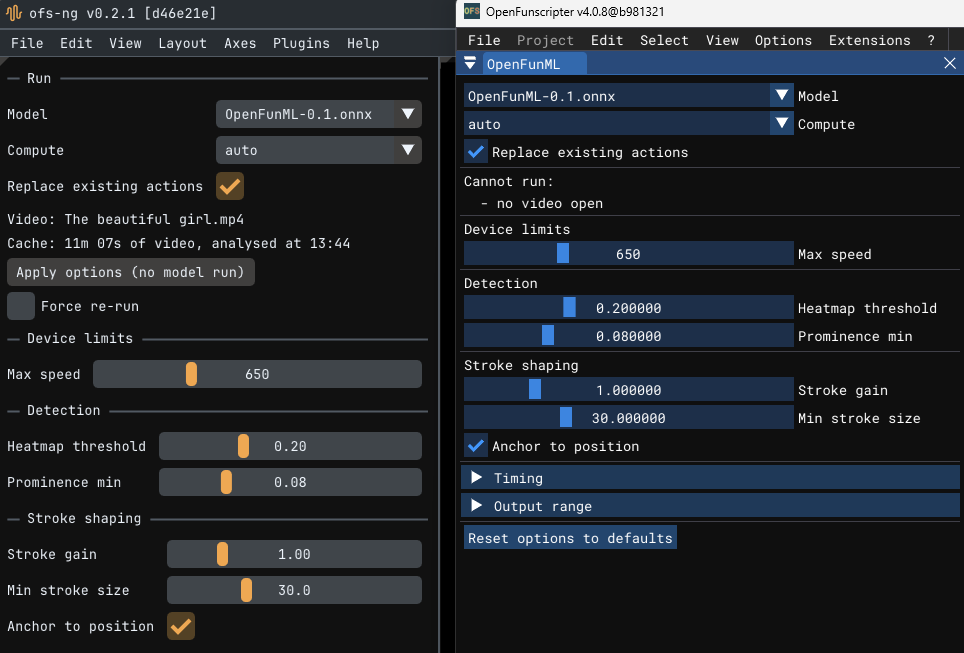
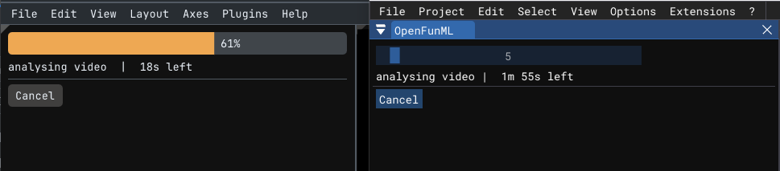
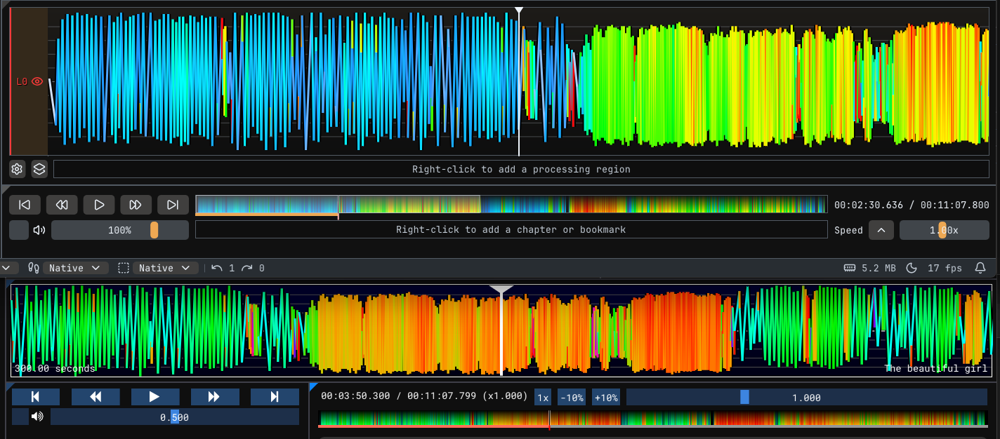

**English** | [한국어](README.ko.md)

# OpenFunML

An extension for **ofs-ng** and **OpenFunscripter** that generates funscripts
from video using a machine-learned model.

Windows only.
Uses a DirectX 12 GPU when present, otherwise falls back to the CPU, which is slow.

## Notice

What this extension produces is not a finished script.
It gets the broad shape of the motion right, but the quality is not good enough to use as-is.
It is there so you do not start from an empty timeline.
Please do not upload generated scripts without editing them, so the community does not fill up with AI slop.

## Download

Both extensions use the same engine.
Download the file that matches the editor you use.

| File | For |
|---|---|
| `OpenFunML-ofs-ng.zip` | ofs-ng |
| `OpenFunML-ofs.zip` | OpenFunscripter 3 |

## Install

**ofs-ng** — do not extract it. Go to **Plugins → Install plugin from zip…**,
pick the zip, and confirm the trust prompt.
To remove it: **Plugins → OpenFunML → Uninstall…**

**OpenFunscripter 3** — extract it, then right-click `install.ps1` →
**Run with PowerShell**. Restart OFS and enable **Extensions → OpenFunML**.
If the ps1 script does not work, copy the folder into the extensions folder by hand.

> %APPDATA%\OFS\OFS3_data\extensions\OpenFunML

## Using it

1. Open a video in the editor.
2. **Plugins → OpenFunML** (ofs-ng) or **Extensions → OpenFunML** (OFS 3).
3. Pick a **Model**, leave **Compute** on `auto`.
4. **Run model and generate**.

The keypoints land on the **L0 (stroke)** track.

The analysis is cached per video, so changing only the options takes about a second.
A different video or a different model triggers a full re-analysis.

## Options

| Option | What it does |
|---|---|
| **Max speed** | Units per second your device can reach. Human scripts run 542 at the 95th percentile, 670 at the 99th |
| **Heatmap threshold** | Lower finds more peaks. The strongest control over stroke count |
| **Prominence min** | Floor for peak detection. Raise it to ignore jitter in quiet sections |
| **Stroke gain** | Scales each stroke around its own midpoint. Above 1.3 the median stroke becomes a full 0–100 swing (human scripts sit at 79) |
| **Min stroke size** | Strokes smaller than this get widened, keeping their centre. 30 is the 10th percentile of human scripts |
| **Anchor to position** | Keeps a fast stroke at the height the model saw it. Off, it drifts to the middle |
| **Time offset ms** | Shifts every keypoint in time. Positive moves them later |
| **Position min / max** | The range of values written to the script |
| **Replace existing actions** | Off: generated actions are merged into the existing script |

## Terms for using the model

You may use the `.onnx` model in other programs as long as these hold:
- the model filename is kept, and the model name is visible in the UI
- not used in paid software

Credit is not required, but it is appreciated.

## Checking issues

`log.txt` in the plugin folder holds the last run.

| Editor | Path |
|---|---|
| ofs-ng | `%APPDATA%\ofs\ofs-ng\plugins\OpenFunML` |
| OFS 3 | `%APPDATA%\OFS\OFS3_data\extensions\OpenFunML` |

The program is unsigned, so antivirus false positives happen.
If SmartScreen blocks it, **More info → Run anyway**;
if Defender quarantines it, add the folder above as an exclusion.
